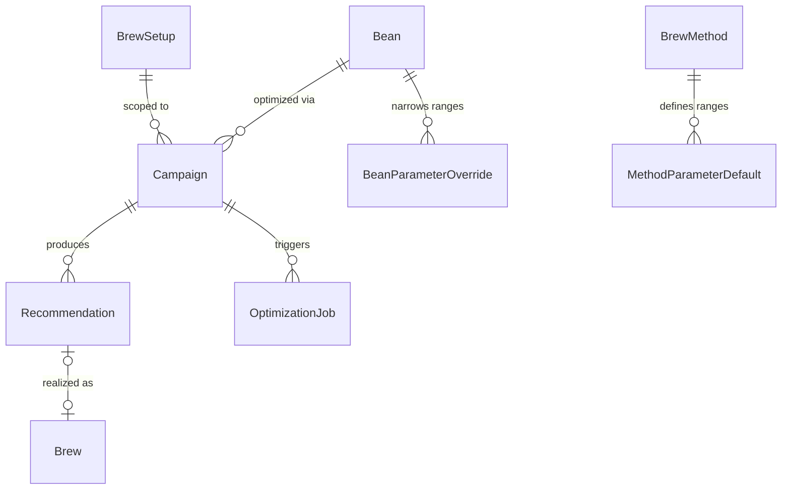

# BayBE Optimization Integration — Design Spec

## Overview

Integrate BayBE (Bayesian optimization) into the BeanBay REST API on the `feat/refactor` branch. The system suggests optimal brew parameters (grind, temperature, dose, etc.) per bean and brew setup, learning from user feedback to converge on the best recipe. Supports multiple brew methods (espresso, pour-over, french press, aeropress, turkish, moka pot, cold brew) with method-appropriate parameter spaces and equipment capability gating.

## Key Design Decisions

| # | Topic | Decision | Rationale |
|---|---|---|---|
| 1 | Campaign scoping | Bean + BrewSetup | Persists across bags. A new bag of the same bean inherits all prior learning. |
| 2 | Person handling | Shared campaign, per-person analytics | Everyone's brews feed one campaign (person-independent optimization). Per-person bean preferences shown separately. |
| 3 | Parameter ranges | Method defaults → equipment capabilities → bean overrides | Three layers, each optional. No hardcoded grind ranges — grind always from grinder. |
| 4 | Recommendation flow | Async with polling (taskiq) | POST returns job ID, frontend polls for result. InMemoryBroker for local use. |
| 5 | Plot data | Hybrid | Raw brews via existing `GET /brews`. Optimization-specific computed data (convergence, phase) via dedicated endpoint. |
| 6 | Transfer learning | Deferred | Campaigns persist across bags so data accumulates naturally. Add transfer learning later if needed. |
| 7 | Person preferences | Bean-level only | Favorite beans, flavor profiles, origin preferences. Recipe preference analysis deferred — needs more per-person data to be meaningful. |

## Database Schema

### New Columns on Existing `Brew` Model

All nullable. Only relevant for specific brew methods / equipment capabilities.

```python
# Pour-over
bloom_weight: float | None = None          # bloom water in grams

# Espresso (capability-gated)
preinfusion_pressure: float | None = None   # bar, during pre-infusion phase
pressure_profile: str | None = None         # ramp_up/flat/decline/custom
brew_mode: str | None = None                # aeropress: standard/inverted
saturation: float | None = None             # flow control saturation
bloom_pause: float | None = None            # bloom wait duration in seconds
temp_profile: str | None = None             # flat/declining/profiling
```

### New Models

#### Campaign

The core optimization unit. One campaign per bean + brew setup combination. Contains BayBE's internal state as an opaque JSON blob alongside queryable relational metadata.

```python
class Campaign(SQLModel, table=True):
    __tablename__ = "campaigns"
    __table_args__ = (
        UniqueConstraint("bean_id", "brew_setup_id", name="uq_campaign_bean_setup"),
    )

    id: uuid.UUID             # PK
    bean_id: uuid.UUID        # FK → beans.id (indexed)
    brew_setup_id: uuid.UUID  # FK → brew_setups.id (indexed)

    campaign_json: str | None = None   # Serialized BayBE Campaign (opaque blob)
    phase: str = "random"              # random | learning | optimizing
    measurement_count: int = 0
    best_score: float | None = None

    bounds_fingerprint: str | None = None  # Hash of numeric parameter ranges
    param_fingerprint: str | None = None   # Hash of parameter names

    created_at: datetime
    updated_at: datetime
```

**Notes:**
- `campaign_json` stores the trained GP model. Only the optimizer service reads/writes this.
- `phase`, `measurement_count`, `best_score` are denormalized for fast frontend queries.
- Fingerprints detect when effective parameter ranges change (e.g. bean override edited, grinder swapped). When a fingerprint mismatch is detected, the campaign is rebuilt with new ranges but retains measurement history.

#### MethodParameterDefault

Seeded data defining which parameters are optimizable per brew method, with sensible default ranges. `parameter_name` maps to `Brew` model column names.

```python
class MethodParameterDefault(SQLModel, table=True):
    __tablename__ = "method_parameter_defaults"
    __table_args__ = (
        UniqueConstraint("brew_method_id", "parameter_name",
                         name="uq_method_param"),
    )

    id: uuid.UUID                # PK
    brew_method_id: uuid.UUID    # FK → brew_methods.id (indexed)

    parameter_name: str          # Brew column name
    min_value: float | None = None      # None for categoricals
    max_value: float | None = None      # None for categoricals
    step: float | None = None           # Rounding precision
    allowed_values: str | None = None   # Comma-separated for categoricals
    requires: str | None = None         # Capability gate condition

    created_at: datetime
    updated_at: datetime
```

**Notes:**
- `requires` contains condition strings evaluated against the brewer at campaign creation time (e.g. `"preinfusion_type != none"`, `"has_bloom == true"`).
- `grind_setting` is NOT included — grind range always comes from the grinder's `ring_sizes_json`.
- For categorical parameters (`pressure_profile`, `brew_mode`, `temp_profile`): `min_value` and `max_value` are NULL, `allowed_values` contains the options.

#### BeanParameterOverride

Optional per-bean range narrowing. Either or both bounds can be set.

```python
class BeanParameterOverride(SQLModel, table=True):
    __tablename__ = "bean_parameter_overrides"
    __table_args__ = (
        UniqueConstraint("bean_id", "parameter_name",
                         name="uq_bean_param_override"),
    )

    id: uuid.UUID             # PK
    bean_id: uuid.UUID        # FK → beans.id (indexed)

    parameter_name: str
    min_value: float | None = None
    max_value: float | None = None

    created_at: datetime
    updated_at: datetime
```

#### Recommendation

A set of parameter values suggested by BayBE. Linked to a `Brew` once the user records the result.

```python
class Recommendation(SQLModel, table=True):
    __tablename__ = "recommendations"

    id: uuid.UUID              # PK
    campaign_id: uuid.UUID     # FK → campaigns.id (indexed)
    brew_id: uuid.UUID | None  # FK → brews.id (set when brewed)

    phase: str                 # Phase at generation time
    predicted_score: float | None = None
    predicted_std: float | None = None
    parameter_values: str      # JSON dict of parameter_name → value

    status: str = "pending"    # pending | brewed | skipped
    created_at: datetime
```

#### OptimizationJob

Async job tracking for taskiq recommendation tasks.

```python
class OptimizationJob(SQLModel, table=True):
    __tablename__ = "optimization_jobs"

    id: uuid.UUID              # PK
    campaign_id: uuid.UUID     # FK → campaigns.id (indexed)

    job_type: str              # recommend | rebuild
    status: str = "pending"    # pending | running | completed | failed
    result_id: uuid.UUID | None = None   # recommendation_id when complete
    error_message: str | None = None

    created_at: datetime
    completed_at: datetime | None = None
```

### ERD (New Models Only)



### Indexes

- `campaigns`: composite index on `(bean_id, brew_setup_id)` — unique constraint provides this
- `recommendations`: index on `campaign_id`; index on `brew_id` (nullable)
- `optimization_jobs`: index on `campaign_id`; index on `status` for polling
- `method_parameter_defaults`: composite index on `(brew_method_id, parameter_name)` — unique constraint provides this
- `bean_parameter_overrides`: composite index on `(bean_id, parameter_name)` — unique constraint provides this

## Parameter Range System

Three-layer system computing effective optimization ranges at campaign creation time.

### Layer 1: Method Defaults (seeded data)

Wide sensible ranges per brew method. `grind_setting` excluded — always from grinder.

**Espresso:**

| parameter | min | max | step | requires |
|---|---|---|---|---|
| temperature | 85.0 | 105.0 | 0.5 | — |
| dose | 15.0 | 25.0 | 0.1 | — |
| yield_amount | 25.0 | 50.0 | 0.5 | — |
| pre_infusion_time | 0.0 | 15.0 | 0.5 | `preinfusion_type != none` |
| preinfusion_pressure | 1.0 | 6.0 | 0.5 | `preinfusion_type in (adjustable_pressure, programmable)` |
| pressure | 6.0 | 12.0 | 0.5 | `pressure_control_type in (opv_adjustable, electronic, programmable)` |
| flow_rate | 0.5 | 4.0 | 0.1 | `flow_control_type != none` |
| saturation | 0.0 | 1.0 | 0.1 | `flow_control_type != none` |
| bloom_pause | 0.0 | 10.0 | 0.5 | `has_bloom == true` |
| pressure_profile | — | — | — | `pressure_control_type in (manual_profiling, programmable)` |
| brew_mode | — | — | — | `flow_control_type == programmable` |
| temp_profile | — | — | — | `temp_control_type == profiling` |

Categorical values: `pressure_profile`: ramp_up, flat, decline, custom. `brew_mode` (espresso): auto, manual. `temp_profile`: flat, declining, profiling.

**Pour-over:**

| parameter | min | max | step |
|---|---|---|---|
| temperature | 85.0 | 100.0 | 0.5 |
| dose | 12.0 | 30.0 | 0.5 |
| yield_amount | 200.0 | 500.0 | 10.0 |
| bloom_weight | 20.0 | 90.0 | 5.0 |

**French Press:**

| parameter | min | max | step |
|---|---|---|---|
| temperature | 85.0 | 100.0 | 0.5 |
| dose | 12.0 | 30.0 | 0.5 |
| yield_amount | 200.0 | 500.0 | 10.0 |
| total_time | 180.0 | 480.0 | 15.0 |

**AeroPress:**

| parameter | min | max | step |
|---|---|---|---|
| temperature | 75.0 | 100.0 | 0.5 |
| dose | 10.0 | 25.0 | 0.5 |
| yield_amount | 150.0 | 300.0 | 10.0 |
| total_time | 60.0 | 300.0 | 10.0 |

Categorical: `brew_mode`: standard, inverted.

**Turkish:**

| parameter | min | max | step |
|---|---|---|---|
| temperature | 85.0 | 100.0 | 0.5 |
| dose | 5.0 | 15.0 | 0.5 |
| yield_amount | 50.0 | 150.0 | 10.0 |

**Moka Pot:**

| parameter | min | max | step |
|---|---|---|---|
| temperature | 85.0 | 100.0 | 0.5 |
| dose | 10.0 | 25.0 | 0.5 |
| yield_amount | 30.0 | 120.0 | 10.0 |

**Cold Brew:**

| parameter | min | max | step |
|---|---|---|---|
| dose | 30.0 | 120.0 | 5.0 |
| yield_amount | 400.0 | 1200.0 | 50.0 |
| total_time | 720.0 | 1440.0 | 60.0 |

### Layer 2: Equipment Capabilities (computed, not stored)

The optimizer service narrows ranges using existing brewer/grinder models:

- **grind_setting** → computed from `Grinder.ring_sizes_json` (full range of the grinder)
- **temperature** → clipped to `Brewer.temp_min / temp_max`
- **pressure** → clipped to `Brewer.pressure_min / pressure_max`
- **pre_infusion_time** → capped at `Brewer.preinfusion_max_time`
- **Capability gating** → parameters excluded entirely if brewer lacks the capability (e.g. `flow_rate` excluded when `brewer.flow_control_type == "none"`)

No extra DB tables — logic lives in the optimizer service.

### Layer 3: Bean Overrides (user-defined via API)

Optional per-bean narrowing via `BeanParameterOverride` rows:

```
Bean: "Ethiopia Yirgacheffe"
  temperature: min=90.0, max=96.0    # narrower than method default
  dose: min=17.0, max=None           # only narrows lower bound
```

### Effective Range Computation

```python
effective_min = max(method_default.min, equipment.min, bean_override.min)
effective_max = min(method_default.max, equipment.max, bean_override.max)
```

If no grinder is on the setup, `grind_setting` is excluded (preground coffee). If effective_min >= effective_max for any parameter after layering, the campaign cannot be created — API returns a validation error.

## API Endpoints

All new routes under `/api/v1/optimize`.

### Campaign Management

```
GET    /optimize/campaigns
       Query params: bean_id, brew_setup_id, brew_method_id
       Response: [{id, bean_name, brew_setup_name, phase, measurement_count,
                   best_score, created_at}]

GET    /optimize/campaigns/{campaign_id}
       Response: {id, bean, brew_setup, phase, measurement_count, best_score,
                  effective_ranges: [{parameter_name, min, max, step, source}]}

POST   /optimize/campaigns
       Body: {bean_id, brew_setup_id}
       Response: campaign detail
       Note: Idempotent — returns existing campaign if one exists for this
             bean + brew_setup combination.

DELETE /optimize/campaigns/{campaign_id}
       Resets campaign (deletes BayBE state + recommendations, keeps brews).
```

### Recommendations (async)

```
POST   /optimize/campaigns/{campaign_id}/recommend
       Kicks off async BayBE recommendation via taskiq.
       Response: {job_id, status: "pending"}

GET    /optimize/jobs/{job_id}
       Poll job status.
       Response: {job_id, status, recommendation_id (when completed),
                  error_message (when failed)}

GET    /optimize/campaigns/{campaign_id}/recommendations
       List recommendations for campaign.
       Response: [{id, parameter_values, phase, predicted_score,
                   predicted_std, status, brew_id, created_at}]

GET    /optimize/recommendations/{recommendation_id}
       Recommendation detail.
       Response: {id, parameter_values, phase, predicted_score,
                  predicted_std, status, brew_id}

POST   /optimize/recommendations/{recommendation_id}/skip
       Mark recommendation as skipped.

POST   /optimize/recommendations/{recommendation_id}/link
       Link a brew to this recommendation.
       Body: {brew_id}
```

### Parameter Ranges

```
GET    /optimize/defaults/{brew_method_id}
       Method parameter defaults.
       Response: [{parameter_name, min_value, max_value, step, requires,
                   allowed_values}]

GET    /optimize/beans/{bean_id}/overrides
       Bean parameter overrides.
       Response: [{id, parameter_name, min_value, max_value}]

PUT    /optimize/beans/{bean_id}/overrides
       Set/replace all overrides for a bean.
       Body: [{parameter_name, min_value, max_value}]
```

### Convergence & Progress

```
GET    /optimize/campaigns/{campaign_id}/progress
       Optimization-specific computed data.
       Response: {phase, measurement_count, best_score,
                  convergence: {status, improvement_rate},
                  score_history: [{shot_number, score, is_failed, phase}]}
```

Convergence status values: `getting_started` (<3 shots), `exploring` (random phase), `learning` (bayesian, still improving), `converged` (bayesian, improvement rate < threshold).

### Per-Person Preferences

```
GET    /optimize/people/{person_id}/preferences
       Bean-level preference analysis.
       Response: {person, brew_stats: {total_brews, avg_score},
                  top_beans: [{bean_id, name, avg_score, brew_count}],
                  flavor_profile: [{tag, frequency}],
                  roast_preference: {avg_degree, distribution},
                  origin_preferences: [{origin, avg_score, brew_count}],
                  method_breakdown: [{method, brew_count, avg_score}]}
```

All computed from joins across existing tables (`Brew → BrewTaste → Bag → Bean → origins/flavor_tags`) filtered by `person_id`. No new tables needed.

## Async Job System

### Architecture

```
Frontend                    API                      Taskiq Worker
   │                         │                            │
   ├─ POST /recommend ──────►│                            │
   │                         ├─ create OptimizationJob ──►│
   │◄── {job_id, "pending"} ─┤    enqueue task            │
   │                         │                            │
   │─ GET /jobs/{id} ───────►│                            │
   │◄── {status: "pending"}──┤                            │
   │                         │                            │
   │                         │         ┌──────────────────┤
   │                         │         │ load campaign     │
   │                         │         │ query brews       │
   │                         │         │ compute ranges    │
   │                         │         │ check fingerprints│
   │                         │         │ add measurements  │
   │                         │         │ campaign.recommend│
   │                         │         │ round values      │
   │                         │         │ snap grind steps  │
   │                         │         │ save campaign_json│
   │                         │         │ create Recommend. │
   │                         │         └──────────────────►│
   │                         │                            │
   │─ GET /jobs/{id} ───────►│                            │
   │◄── {status: "completed",│                            │
   │     recommendation_id} ─┤                            │
```

### Broker

`InMemoryBroker` with `InmemoryResultBackend` — no Redis/RabbitMQ dependency for local use. Swappable to a real broker later.

### Worker Task

1. Load campaign from DB (`campaign_json` → BayBE `Campaign`)
2. Query all brews for this bean + setup, join taste scores
3. Compute effective parameter ranges (3-layer system)
4. Check fingerprints — rebuild campaign if ranges changed
5. Add any new measurements to campaign
6. `campaign.recommend(batch_size=1)`
7. Round values to step precision per parameter
8. Snap grind setting to valid grinder steps if stepped grinder
9. Create `Recommendation` row
10. Save updated `campaign_json`, `phase`, `measurement_count`, `best_score`
11. Update `OptimizationJob` → `completed` with `result_id`

### Error Handling

- Worker catches BayBE exceptions → sets job status to `"failed"` with `error_message`
- No automatic retry — user can manually request a new recommendation

## BayBE Campaign Configuration

- **Recommender:** `TwoPhaseMetaRecommender` — random exploration for the first 5 measurements, then `BotorchRecommender` for Bayesian optimization
- **Target:** `NumericalTarget(name="score")` (from `BrewTaste.score`)
- **Objective:** `SingleTargetObjective` — maximize taste score
- **Search space:** built from effective parameter ranges
  - Continuous parameters → `NumericalContinuousParameter`
  - Categorical parameters → `CategoricalParameter` with OHE encoding

## Measurement Flow

No separate measurement table. Existing `Brew` + `BrewTaste` records serve as optimization measurements.

1. User creates a brew via `POST /api/v1/brews` (existing endpoint) with taste score
2. When the optimizer generates a recommendation, it queries all brews for the campaign's `bean_id + brew_setup_id` as training data
3. If the brew was made from a recommendation, `POST /optimize/recommendations/{id}/link` connects them

This means manual brews (not from recommendations) also feed the optimizer — any brew for the same bean + setup contributes to learning.

## What's NOT Included (Deferred)

- **Transfer learning** — seeding new campaigns from similar beans. Campaigns persist across bags, so data accumulates naturally.
- **Per-person recipe preferences** — "Sarah prefers higher temps." Needs more per-person data to be statistically meaningful.
- **GrinderMethodRange** — per-grinder per-method sweet spots. The optimizer handles wide ranges well; users can narrow via `BeanParameterOverride` if desired.
- **Frontend design** — separate spec. This document covers API and database only.
